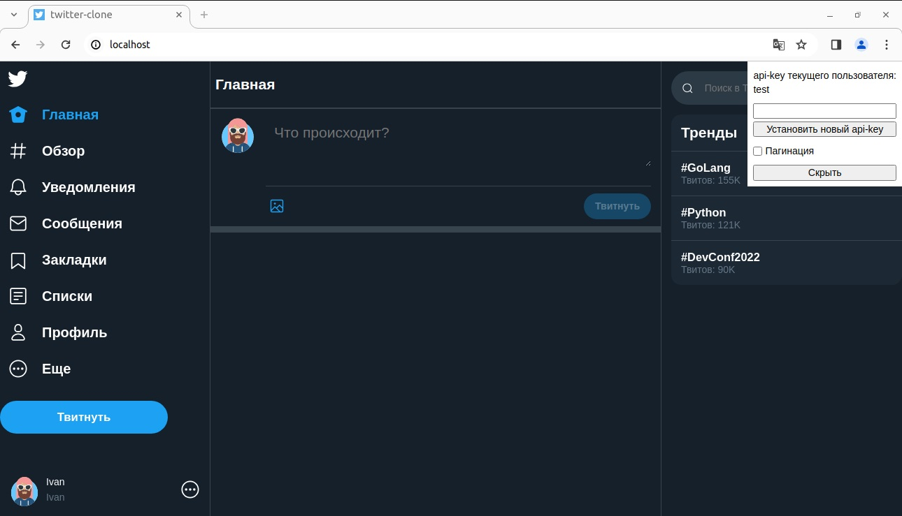
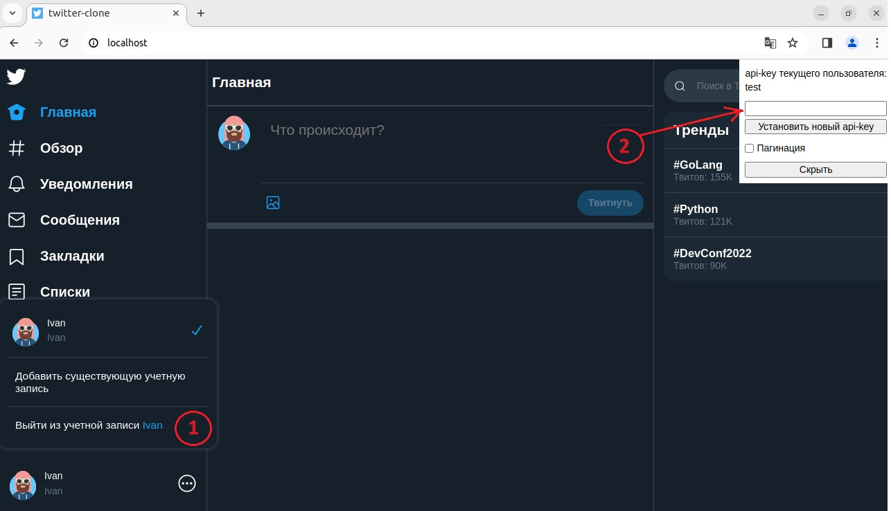
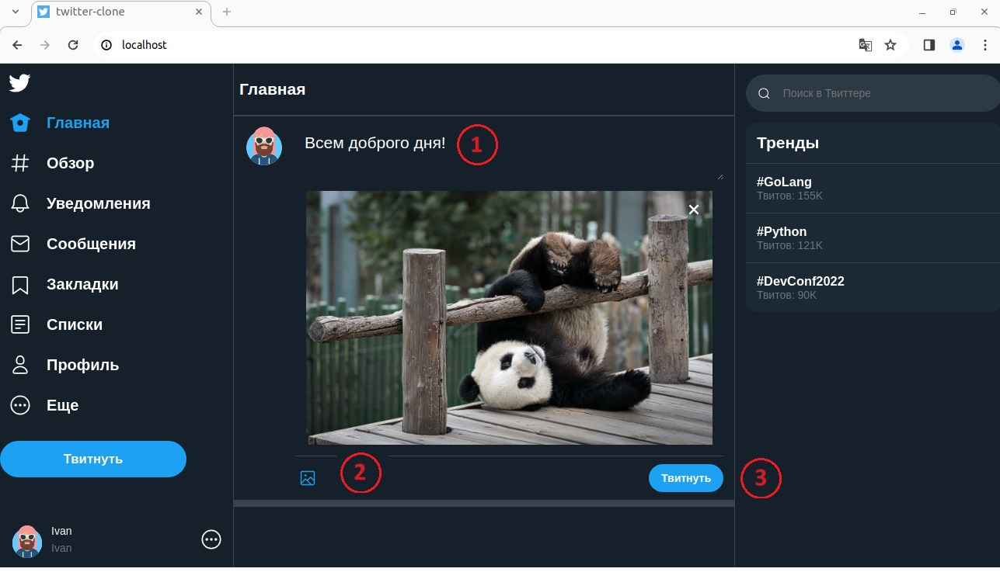
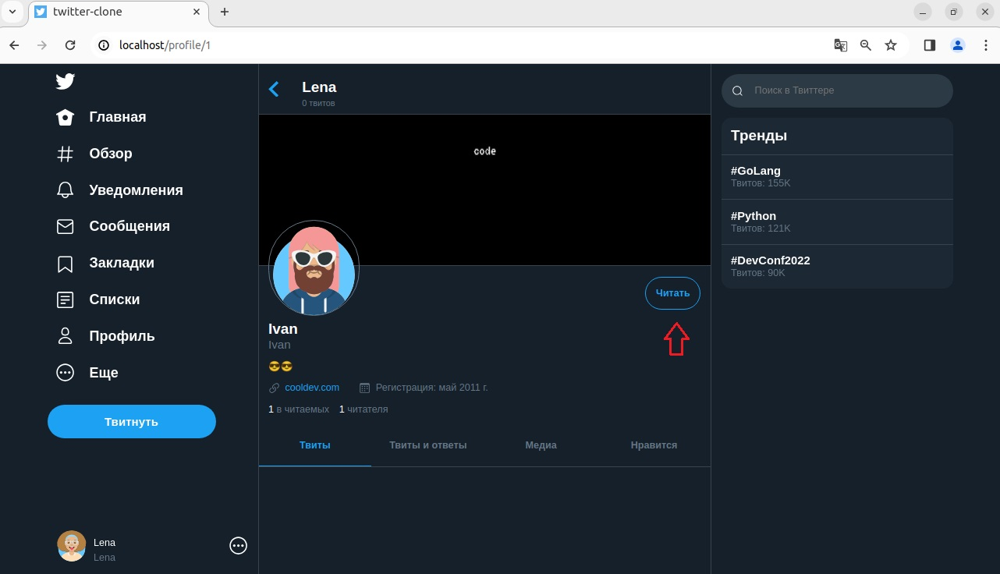
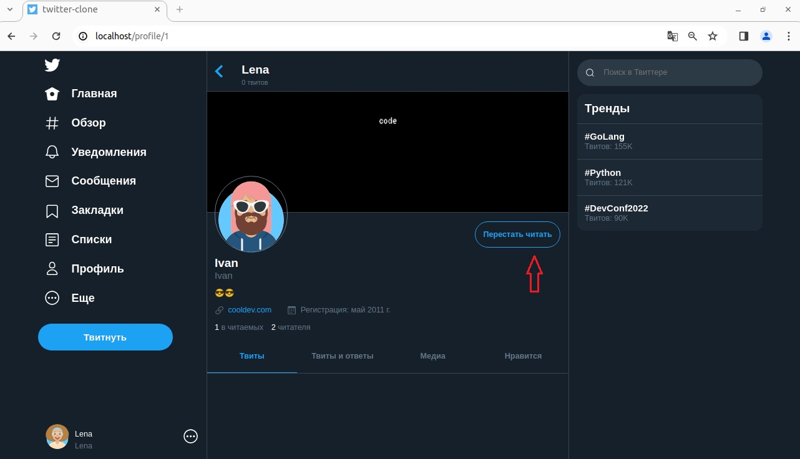

# Сервис микроблогов
### Реализация бэкенда сервиса микроблогов (мини-клон сервиса Twitter)*
###### * Функционал фронтенда сильно урезан

Этот проект демонстрирует асинхронное использование SQLAlchemy 2.0 с FastAPI (в качестве базы данных используется PostgreSQL).

В  проекте реализован функционал:

* добавление нового твита
* удаление пользователем своего твита
* возможность подписаться (зафоловить) на другого пользователя
* возможность отписаться от другого пользователя
* отметить понравившийся твит как "Нравится"
* снять с твита отметку "Нравится" 

## Запуск проекта

Для развертывания проекта используется `Docker Compose`.

Чтобы запустить проект используем команду:
```
docker compose up -d
```

При первом запуске проекта создается база данных. 
Для подключения к ней необходимо перезапустить контейнер с приложением `mblog-web`:
```
docker restart mblog-web
```
Стартовая страница проекта [http://0.0.0.0](http://0.0.0.0) или ([http://localhost](http://localhost)).



## Функционал
### Смена пользователя


Для смены пользователя в текущем профиле пользователя (нижний левый угол экрана) выбирается пункт **"Выйти из учетной записи ..."** (п.1)

В появившемся в правом верхнем углу экрана окне (п.2) набираем api-key ключ нужного пользователя.

В сервисе зарегистрировано 4 пользователя с api-key ключами: test, test1, test2, test3.

### Добавление твита



Набираем текст (п.1), при желании добавляем картинку (п.2) и нажимаем "Твитнуть" (п.3).

### Удаление твита


В правом верхнем углу твита выбираем ... и нажимаем **Удалить**.

*Удалить можно только свой твит*

### Лайкнуть (отметить понравившийся твит)


Кликнув мышкой по сердечку под твитом можно отметить или снять отметку "Нравится".

### Подписаться на (отписаться от) пользователя


Кликнув мышкой по аватарке пользователя в ленте твитов
попадаем на страничку данного пользователя.
Выбрав меню "Читать" мы становимся его читателями (оформляем подписку).



Или выбрав меню "Перестать читать" мы от пользователя отписываемся.

## Документация проекта

Документацию можно посмотреть по адресу [http://0.0.0.0/api/docs](http://0.0.0.0/api/docs)
или [http://0.0.0.0/api/redoc](http://0.0.0.0/api/redoc)

## Тестирование проекта

Для тестирования проекта нужно перейти в каталог `test`

```
cd test
```

Запустить контейнер с тестовой базой данных

```
docker compose up -d
```
и запустить тесты:

```
pytest -v
```

## Licence

Author: Stanislav Rubtsov

